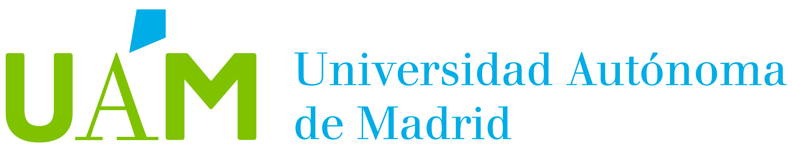

..
  UAM edX LA documentation master file, created by
  sphinx-quickstart on Sat Jun  6 18:14:50 2020.
  You can adapt this file completely to your liking, but it should at least
  contain the root `toctree` directive.

Welcome to UAM edX LA's documentation!
======================================

..
  Maybe use `figure` instead of `image`

    caption

.. toctree::
   :maxdepth: 2
   :caption: Contents:

   Scripts/Python/modules.rst
   guia_basica.rst

.. toctree::
   :maxdepth: 2
   :caption: Reuniones

   ReunionesRuth.md

First time
----------

First time here? Read `README <../README.rst>`_

Indices and tables
==================

* :ref:`genindex`
* :ref:`modindex`
* :ref:`search`
